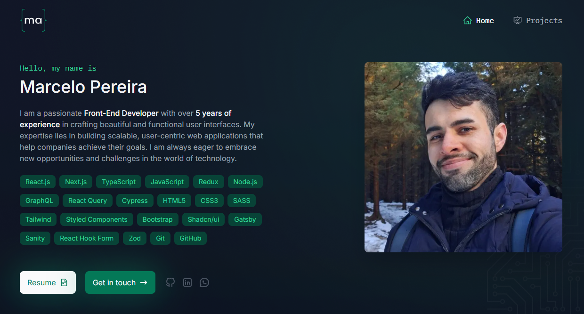
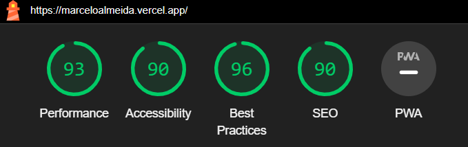

<h1 align="center">
    
</h1>

  <a href="#-about">About</a>&nbsp;&nbsp;&nbsp;|&nbsp;&nbsp;&nbsp;
  <a href="#-projects">Project</a>&nbsp;&nbsp;&nbsp;|&nbsp;&nbsp;&nbsp;
  <a href="#-technologies">Technologies</a>&nbsp;&nbsp;&nbsp;|&nbsp;&nbsp;&nbsp;
  <a href="#-lighthouse">Lighthouse</a>

  

## 💻 About

Welcome to my portfolio! I am a passionate Front-End Engineer dedicated to creating seamless and visually appealing web experiences. Here you can explore my selected projects, which showcase my skills in front-end development and my dedication to delivering high-quality web applications.

## 🚀 Project

🌟 Situation:

As a Front-End Engineer, I needed a standout online portfolio to showcase my skills and projects. The goal was to build a professional, visually engaging website that reflected my expertise and personal brand.

🎯 Task:

Create a portfolio website that:

- Highlights my front-end skills and experience.
- Presents my projects with engaging visuals and details.
- Ensures a great user experience on all devices.

🚀 Action:

I took the following steps to bring this vision to life:

- Technology Stack: Developed with React.js, Next.js and TypeScript for a modular, dynamic site.
- Responsive Design: Employed CSS Grid and Flexbox to ensure the site looks stunning on desktops, tablets, and mobiles.
- Performance Optimization: Utilized code splitting and SSG for fast load times and smooth interactions.
- Content & SEO: Created detailed project showcases with optimized content and implemented SEO best practices.
- Interactivity: Integrated animations and hover effects using Framer Motion to enhance user engagement.

🏆Result:

The website successfully:

- Enhanced My Online Presence: Attracted attention from recruiters and collaborators.
- Received Positive Feedback: Praised for its aesthetics and usability.
- Showcased My Skills: Demonstrated my expertise in building high-quality, user-friendly web applications.

Visit my portfolio and discover my key projects by visiting my website:

<h3 align="center"><a href="https://marcelopereira.vercel.app" target="_blank">https://marcelopereira.vercel.app</a> 🚀🌐</h3>

## 🔧 Technologies

Throughout these projects, I have utilized a variety of technologies and tools, including:

- [React.js](https://reactjs.org/)
- [Next.js](https://nextjs.org/)
- [TypeScript](https://www.typescriptlang.org/)
- [Tailwind CSS](https://tailwindcss.com/)
- [React Hook Form](https://www.react-hook-form.com/)
- [Zod](https://zod.dev/)
- [Hygraph Headless CMS](https://hygraph.com/)
- [GraphQL](https://graphql.org/)
- [Framer Motion](https://www.framer.com/motion/)

## ✨ Lighthouse

A standout feature of my work is the exceptional performance and accessibility of the website, as evaluated by Lighthouse, Google's tool for web quality assessment. Here are the Lighthouse metrics for the site:

  

High Lighthouse scores underscore my dedication to delivering top-tier, user-friendly, and efficient web experiences. Explore the site to see these optimizations in action!
