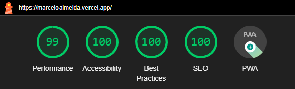

<h1 align="center">
    
</h1>

  <a href="#-about">About</a>&nbsp;&nbsp;&nbsp;|&nbsp;&nbsp;&nbsp;
  <a href="#-projects">Project</a>&nbsp;&nbsp;&nbsp;|&nbsp;&nbsp;&nbsp;
  <a href="#-technologies">Technologies</a>&nbsp;&nbsp;&nbsp;|&nbsp;&nbsp;&nbsp;
  <a href="#-lighthouse">Lighthouse</a>

  

## 💻 About

Welcome to my portfolio! I am a passionate Front-End Engineer dedicated to creating seamless and visually appealing web experiences. Here you can explore my selected projects, which showcase my skills in front-end development and my dedication to delivering high-quality web applications.

## 🚀 Project

Explore the application and discover my key projects by visiting my website: [marceloalmeida.vercel.app](https://marceloalmeida.vercel.app)

## 🔧 Technologies

Throughout these projects, I have utilized a variety of technologies and tools, including:

- [React.js](https://reactjs.org/)
- [Next.js](https://nextjs.org/)
- [TypeScript](https://www.typescriptlang.org/)
- [Tailwind CSS](https://tailwindcss.com/)
- [React Hook Form](https://www.react-hook-form.com/)
- [Zod](https://zod.dev/)
- [Hygraph Headless CMS](https://hygraph.com/)
- [GraphQL](https://graphql.org/)
- [Framer Motion](https://www.framer.com/motion/)

## ✨ Lighthouse

A standout feature of my work is the exceptional performance and accessibility of the website, as evaluated by Lighthouse, Google's tool for web quality assessment. Here are the Lighthouse metrics for the site:

  

High Lighthouse scores underscore my dedication to delivering top-tier, user-friendly, and efficient web experiences. Explore the site to see these optimizations in action!
